# 入门

### 一、 进入BoosIsland

通过复制以下连接至浏览器[https://www.bossislands.com/](https://www.bossislands.com)进入

#### 点击任意建筑的图标可看到该建筑的介绍，确认前往，会出现让您登录的提示页面：

(1) 若您已有账户，则输入对应账户密码进行登录即可

(2) 若您暂无账户，可点击右上角 注册 使用 邮箱注册，之后登录即可

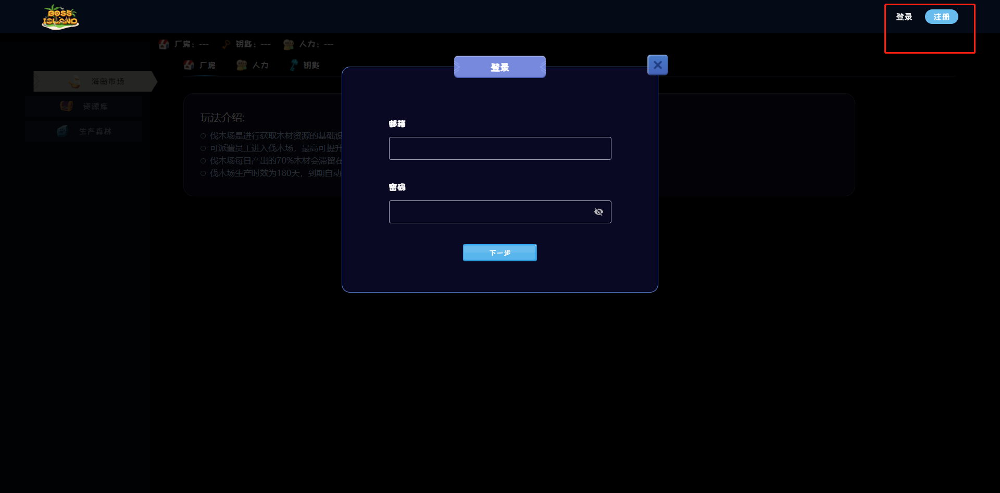

### 二、玩法

### 伐木

1、进入海岛市场(进行生产的基础道具/人力购买的地方)，购买的伐木场系统会自动为您建造于生产森林，每日12:00（UTC+8）为您开采木材

 .png>) .png>)

2、 购买完成后可点击生产森林，查看自己拥有的伐木场列表、如果想要查看某个伐木场的详细信息，可以点击该伐木场。产出效率为每级伐木场产出的木材数量(会衰减)。

&#x20;                                               昨日的产出=产出效率\*木材等级\*(1+员工加成)

&#x20;想要提高的伐木场的产出，可以派遣员工进入(最高10%，公式见下)，点击伐木场下面的派遣按钮选择员工即可。

&#x20;                                员工加成=(1%\*员工总等级)\*10/伐木场等级  截取整数如12.1234%则为12%

 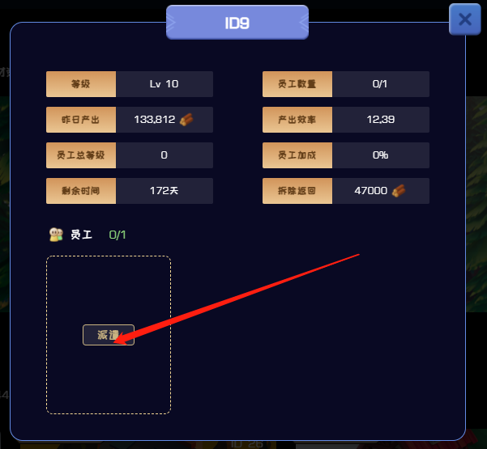 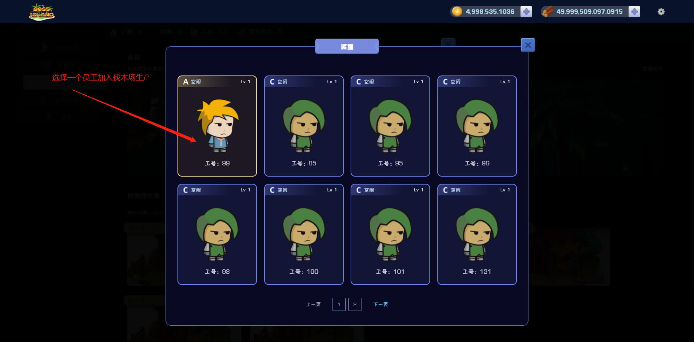 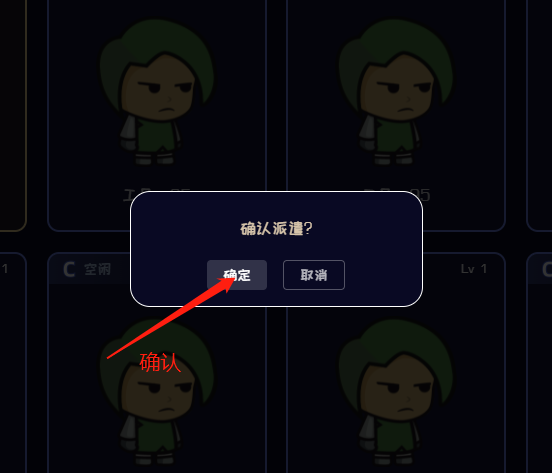 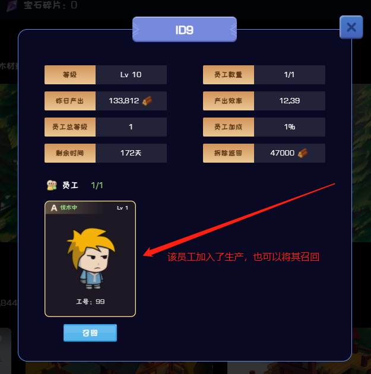

#### 抽取员工

&#x20;      员工是需要人力**抽取**获得，抽取的员工品质及概率见内容详情，10海岛币/次。

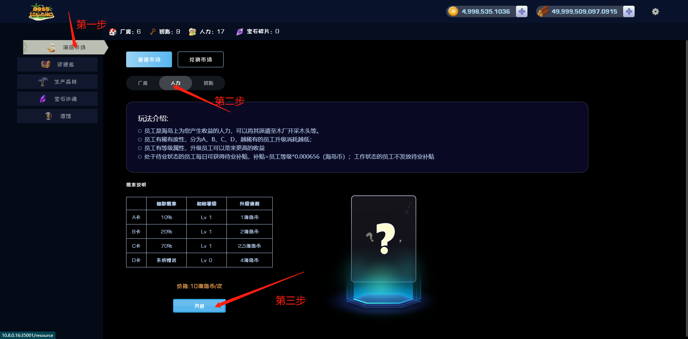 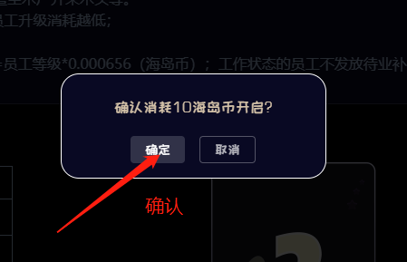 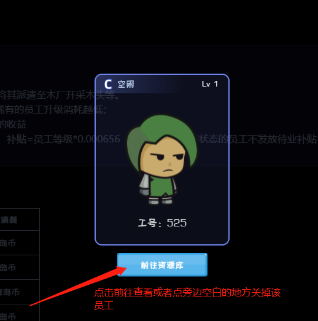

&#x20;      抽取到的员工，会自动为您放置于“资源库”中，若待业(未进行工作伐木/其他)的员工，每日会收到系统的待业补贴(年化6%)，金额如下：

&#x20;                                                补贴金额=员工等级\*0.000656（海岛币）

&#x20;                                       注：左上角会显示发放的补贴金额，金额自动加入账户

3、 员工可为您的产业提供加成，等级越高加成越高，不同品质的员工升级所需金额不一样，当前满级为10级，加成最高为10%。

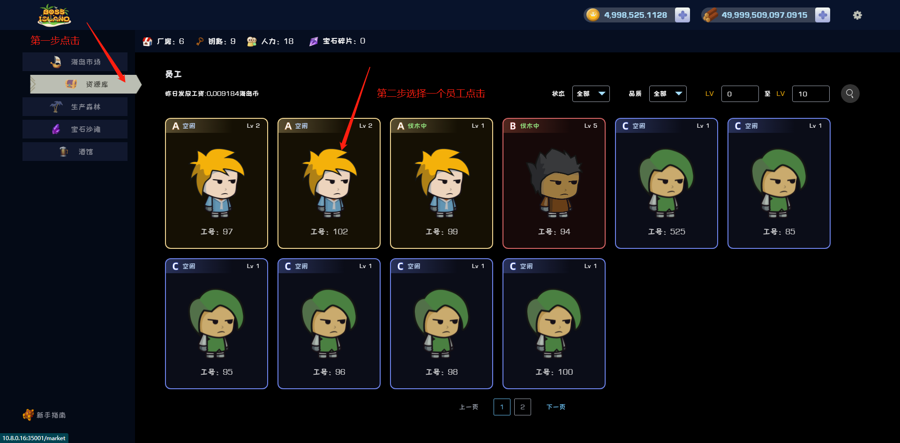 .jpg>) .jpg>) 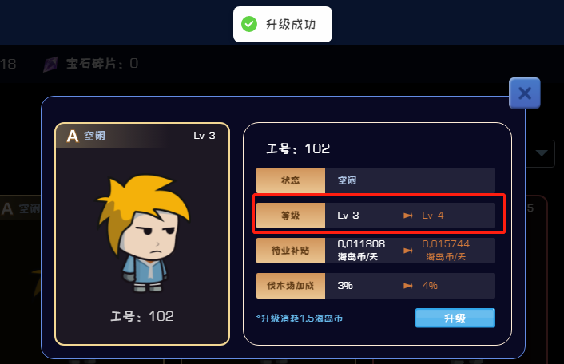

### &#x20;资产充值提取

当前充值暂未开启，系统内海岛币、木材可进行提取，点击资产数额旁边的加号，选择您想要提取的资产，输入对应的地址后支付手续费可进行提取。

(1)木材：最小提取到账数量10000、手续费为500木材

(2)海岛币：最小提取到账数量为1，手续费为1海岛币

&#x20;注：资产充值提取记录可通过点击提取记录进行查看

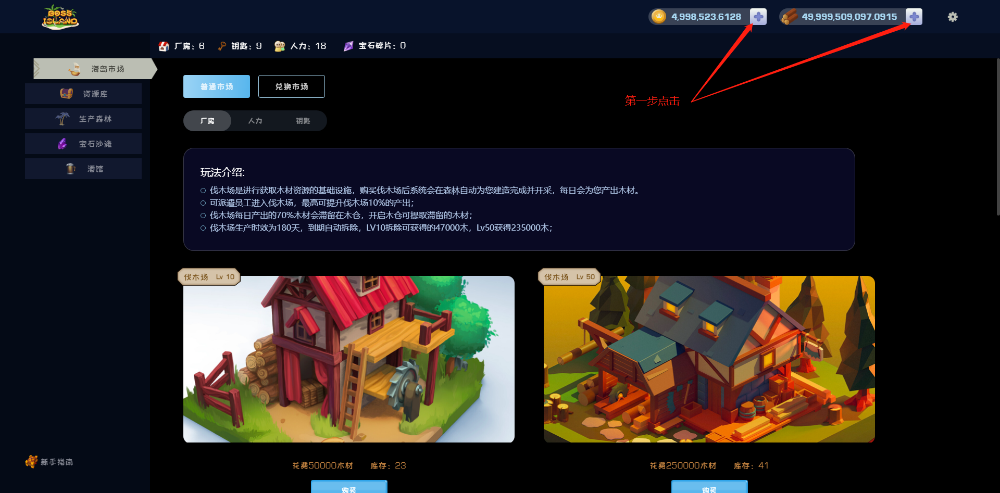 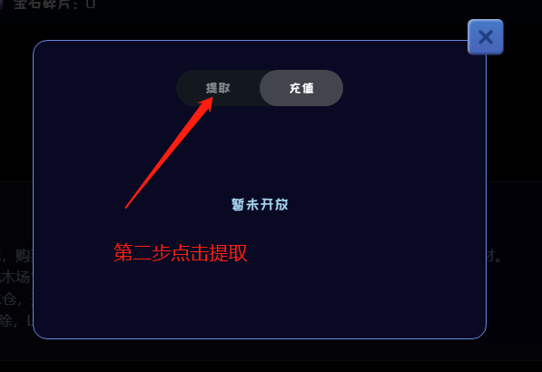 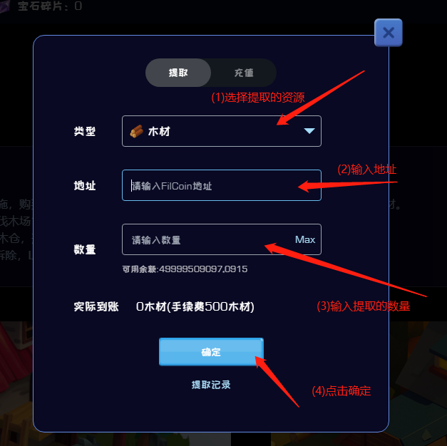 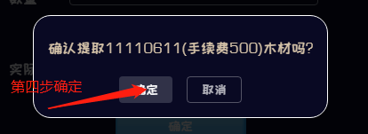 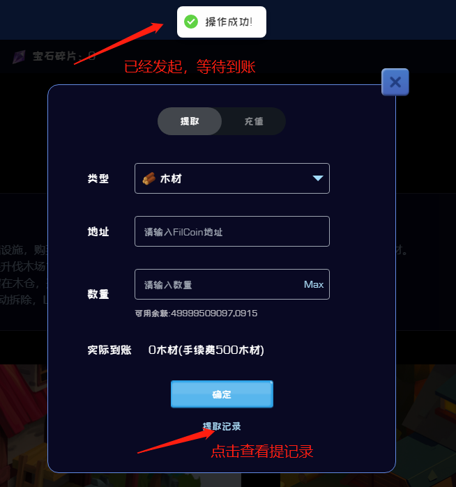 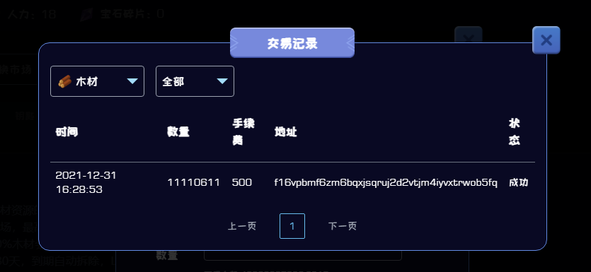

### 注销

点击右上角设置图标，会弹出选项，点击注销，确认退出后即可退出您的账号。

 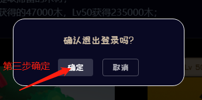
