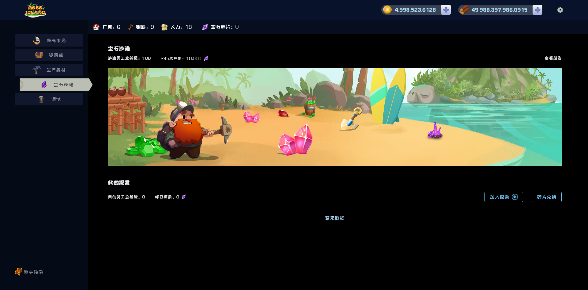

# 💎 宝石沙滩

沙滩拥有着大量的宝石碎片，员工可以进入沙滩探索，每日获得”宝石碎片“ 的奖励

### 探索

&#x20;    点击”加入探索“选择员工(等级最低为1)进入，员工会自动进行探索。探索时长超过100天将不再获得奖励。

### 兑换

&#x20;   宝石碎片可点击兑换后进行其他资源的兑换。

### 奖励

宝石沙滩每日总产出的碎片数量依据[海岛市场](hai-dao-shi-chang.md)今日售出的伐木场、今日售出的员工数量决定

1. 海岛市场每出售10级伐木场，今日起至未来100天每天发放的总碎片数量增加180个
2. 海岛市场每出售1个员工，今日起至未来100天每天发放的总碎片数量增加100个

每个探索的员工获得的奖励计算如下：

&#x20;                           该员工今日奖励碎片=(该员工等级/沙滩员工总等级)\*今日总产出碎片

&#x20;                         当个员工今日探索数量=(该员工等级/沙滩员工总等级)\*今日总产出碎片

注：低于1个碎片按1个碎片发放，大于1非整数则向下取整。

### 提取碎片

&#x20;      员工探索所得碎片可通过提取获得，提取员工碎片需要支付对应的手续费，探索时长越久则提取该员工碎片手续费则越低。具体手续费规则如下：

| 该员工探索天数  | 手续费比率 |
| -------- | ----- |
| x>=90天   | 0     |
| 72<=x<90 | 10%   |
| 36<=x<72 | 20%   |
| 18<=x<36 | 30%   |
| x<18天    | 40%   |
