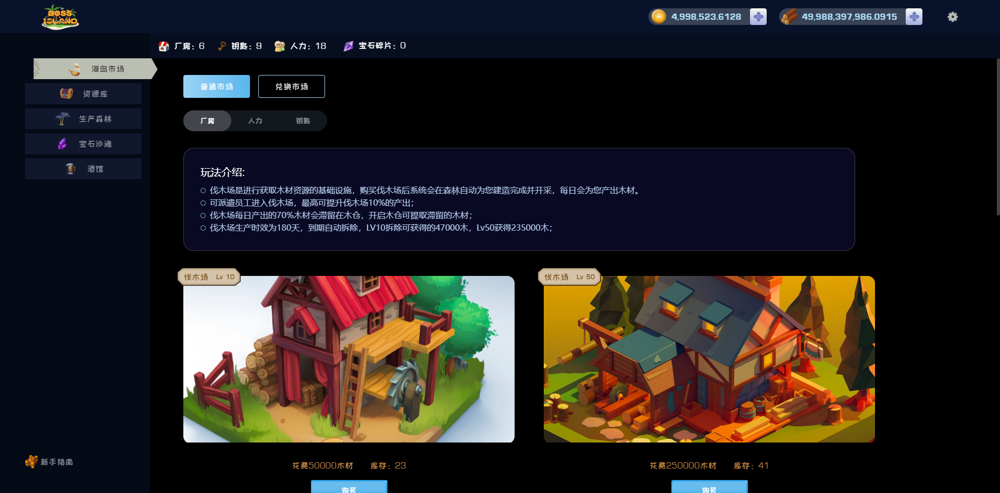
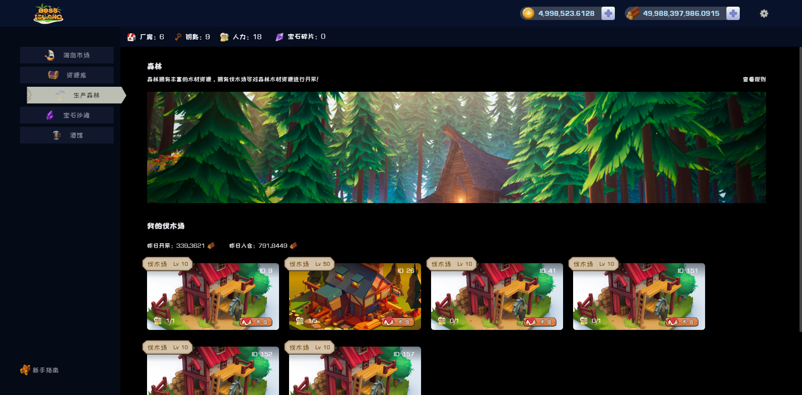

# 🌳 生产森林

**BossIsland 拥有大量的椰子树，您可以通过在椰子林中设立”伐木场“进行伐木，进行木材的获取**

****

### **如何参与**

1. &#x20;通过[海岛市场](../hai-dao-shi-chang.md)，点击普通市场后选择“厂房”。
2. 根据需要购买自身所需的“伐木场”
3. 购买成功后，系统会自动为您在 “椰子林” 建造伐木场
4. 您将在该产业中拥有“伐木场”，每日将为您带来[木材](./#mu-cai)

注：伐木场时效到期后会自动拆除，拆除返还建造时消费的木材

### 木材

1. 木厂建造完成后开始生产，次日产生对应木材，数量计算可见表1
2. 用途：木材可用于出售、兑换、建造
3. 所产出的木材70%需要滞留在木厂的[木材仓库](mu-cang.md)(下文称为[木仓](mu-cang.md))

<table><thead><tr><th align="center">类型</th><th align="center">售价</th><th align="center">每日产量</th><th>可容纳员工</th><th>拆除返还木材</th><th data-hidden>木厂类型</th><th data-hidden></th><th data-hidden></th><th data-hidden></th><th data-hidden></th><th data-hidden></th><th data-type="number" data-hidden></th></tr></thead><tbody><tr><td align="center">LV10伐木场</td><td align="center">50000 木材</td><td align="center">产出效率*木厂等级*（1+员工加成）</td><td>1</td><td>47000</td><td></td><td></td><td></td><td></td><td></td><td></td><td>null</td></tr><tr><td align="center">LV50伐木场</td><td align="center">250000 木材</td><td align="center">产出效率*木厂等级*（1+员工加成）</td><td>5</td><td>235000</td><td></td><td></td><td></td><td></td><td></td><td></td><td>null</td></tr></tbody></table>

### 效益加成

&#x20;    过将自身拥有员工进入木厂工作，则木厂每日产出会得到提升，最高为10%，具体可见[等级](../deng-ji.md)

### 过度开采

&#x20;      每日伐木场进行开采会导致BossIsland的椰树数量下降，因此开采获得木材也会日渐减少。
