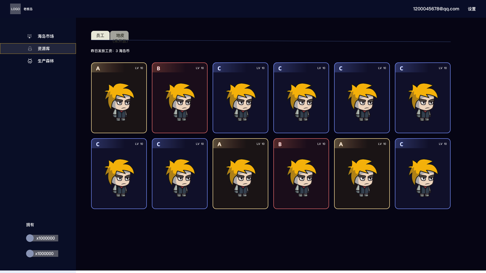

# 💰 待业补贴

### 介绍

&#x20;      待业补贴为BossIsland每日获取海岛币的重要来源，员工未进行**工作**时，系统会每日为这些**待业员工**进行发放补贴，为老板岛的员工提供最基础的收入保障

### 参与方式

&#x20;      点击“资源库”，可以查看自身拥有的员工，0点前未处于“工作中”状态的员工次日中午12时会发放“待业补贴”

### 补贴金额

&#x20;      每日补贴发放会以“海岛币“的形式发放，发放后自动加至自身账户的海岛币资产。补贴金额取决于待业员工等级，随着等级增加补贴也会增加，

&#x20;                                                            <mark style="color:blue;">补贴金额=员工等级\*</mark>0.000656
