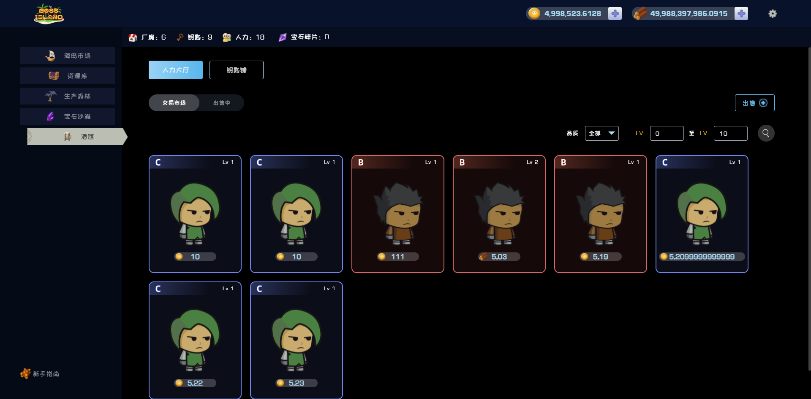
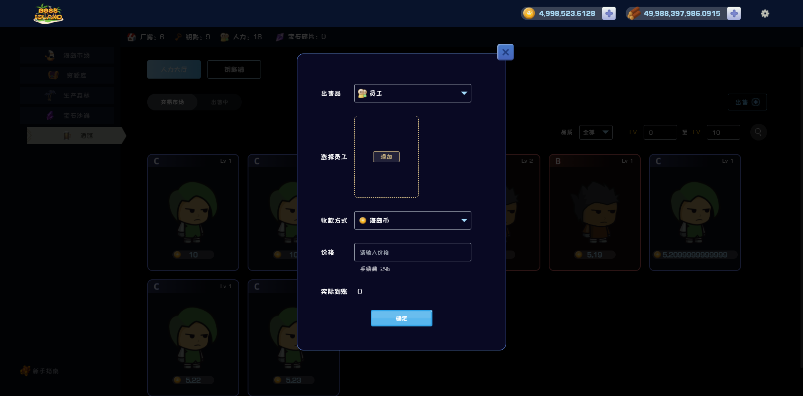
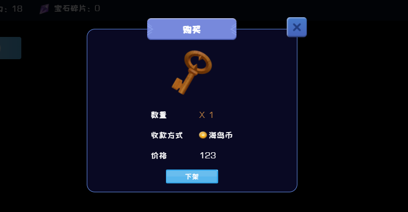

# 🍻 酒馆

玩家与玩家之间进行资源交易的场所

### 交易市场

当前系统玩家正在出售的人力/钥匙，确认购买后该人力/钥匙将会自动加入您的资源库中。

### 出售

人力/钥匙可以进行进行出售，设置您心仪的价格后确认出售即可将人力/钥匙放置于酒馆进行交易。出售会收取您金额的3%手续费。扣除手续费后的金额将会加入您的账户中

### 取消出售

可以点击”下架“将您出售的人力/钥匙放回置您的资源库中。

